  
  

    👋
    <strong>I'm currently focused on reliable AI systems, model evaluation, and research engineering.</strong>
  

  

    <code>🐈 neko · @nya-a-cat</code>
    <code>📍 Meow Planet · UTC+8</code>
  

  

    <a href="mailto:nya-a-cat@outlook.com">Email</a>
    ·
    <a href="https://github.com/nya-a-cat?tab=repositories">Repositories</a>
  

<table>
<tr>
<td valign="top" width="50%">

#### 🔭 Current Focus

- **Agent infrastructure** — auditable sandboxes and execution boundaries.
- **Edge AI verification** — deployment constraints, memory, and policy checks.
- **Research engineering** — reproducible experiments and proof-oriented tooling.

</td>
<td valign="top" width="50%">

#### 💻 Open Source

- 🧭 **[sig-agent](https://github.com/nya-a-cat/sig-agent)** — a compact terminal coding agent with persistent sessions, tool approval, and provider switching.
- 🛡️ **[EdgeFit](https://github.com/nya-a-cat/edgefit)** — static ONNX deployment-contract verification and CI gating.
- 🔥 **[Ferrobox](https://github.com/nya-a-cat/ferrobox)** — a small, auditable Firecracker sandbox runtime for AI agents.
- ☁️ **[GPU Container Cloud](https://github.com/nya-a-cat/gpu-rental-platform)** — GPU cloud control-plane foundations and a transparent simulated baseline.

</td>
</tr>
</table>
